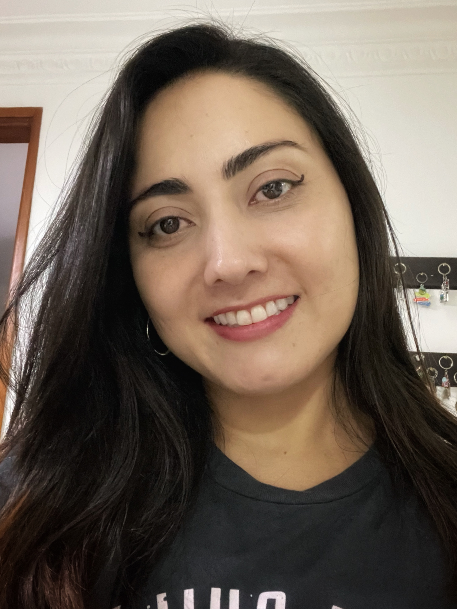

# 👋 Mentores!


**Mentores:** Personas expertas en los temas que te van a compartir.


## Miguel Sierra

👋 CEO — 💌 esme@company.com — 🇺🇸 San Francisco (GMT-7)

### Bio


**GitBook tip:** Encourage employees to write a succinct bio that can help new hires learn about them and how they like to work.


## Vanessa Aristizabal

👋 Senior Web consultant — 💌 vanessamarely — 🇳🇱 Colombia (GMT-5)

<figure><figcaption></figcaption></figure>

### Bio


**Frontend Developer, Ingeniera de sistemas. GDE Angular & tecnologías Web. Github Star.**


##
