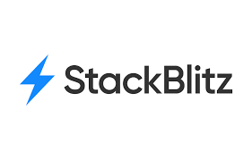

# Herramientas

## Editores de código o texto

Y estos más especializados los llamamos IDE  (Integrated Development Environment) o **Entorno de Desarrollo Integrado**. Los IDE tienen un editor de texto, ademas tienen algunas funciones avanzadas como autocompletar el código, se puede integrar con sistemas de control de versiones, algunos pueden simular dispositivos y pueden gestionar la conección con la base de datos.

Usaremos de manera online: **Stackblitz** y **Codepen**, te recomiendo registrarte en ambas páginas, para que puedas tener la colecciones de tus aplicaciones o páginas Web y puedas acceder a ellas en cualquier momento.

[**Stackblitz**](https://stackblitz.com/) es un IDE en la nube que te permite crear aplicaciones Web. Eso quiere decir que ¡no tienes que instalar nada para crear tu aplicación! 😎

De manera local en nuestras máquinas usaremos [Visual Studio Code](https://code.visualstudio.com/), te recomiendo descargarlo e instalarlo en tu computadora de acuerdo a tu sistema operativo.

<figure><figcaption></figcaption></figure>

[**Codepen** ](https://codepen.io/)es una herramienta de **prototipado rápido y prueba de fragmentos de código**. Solo necesitas acceder a la url de codepen y tendrás un espacio, donde podrás incluir tus líneas de HTML, CSS y JS.

<figure><figcaption></figcaption></figure>

## Manejador de versiones

Para que no tengamos la necesidad de por cada cambio que hagamos en nuestro código y tener ese paso a paso, guardado en algun lugar, evitandonos crear multiples carpetas por versiones como lo haciamos cuando creabamos documentos en sus multiples versiones, existen unas aplicaciones que nos ayudan a manejar el versionamiento, y la que usaremos será [Github](https://github.com/).&#x20;

Podemos seguir la siguiente guia para crear nuestra cuenta en github: [https://ngchallenges.gitbook.io/project/guias-utiles/github](https://ngchallenges.gitbook.io/project/guias-utiles/github)

<figure><figcaption></figcaption></figure>

## Otras Herramientas

Para hacer la instalación de Angular, de manera local en nuestras computadoras, necesitaremos tener instalado [**node.js**](https://nodejs.org/es/) (es un entorno en tiempo de ejecución multiplataforma) y un manejador de paquetes como [**npm** ](https://www.npmjs.com/)(Node Package Manager o simplemente npm es un gestor de paquetes). Te recomiendo instalarlos de acuerdo a tu sistema operativo.

<figure><figcaption></figcaption></figure>

<figure><figcaption></figcaption></figure>

